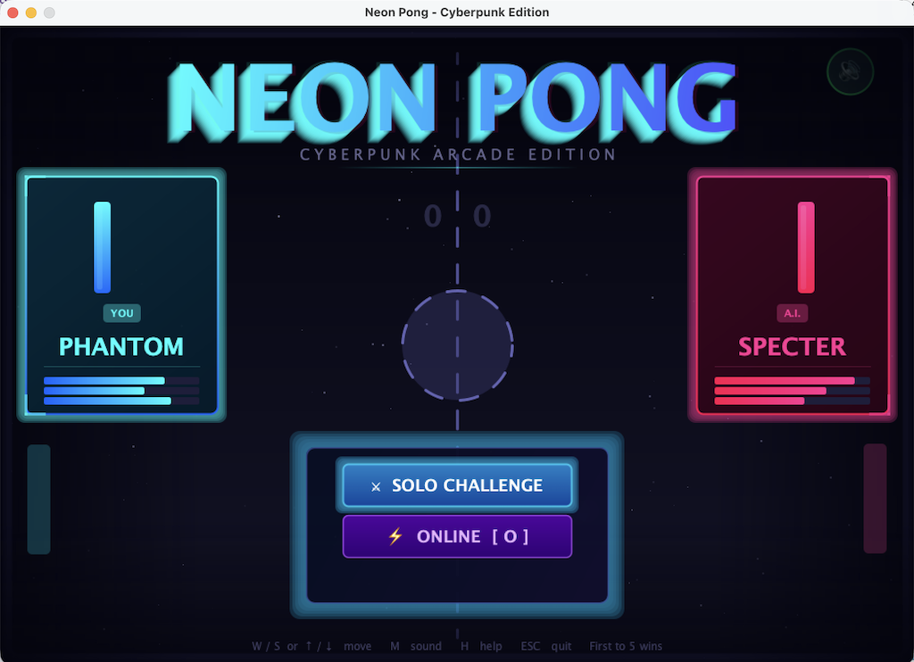

# Neon Pong - Cyberpunk Edition

[](https://opensource.org/licenses/MIT)
[](https://www.oracle.com/java/technologies/javase-downloads.html)
[](https://github.com/github-deewhy/pong-neon)
[](https://neonpong.deewhy.ovh)

<div align="center">
  
  <p><em>⚡ Cyberpunk Arcade Edition · Multiplayer Beta ⚡</em></p>
</div>

## 📋 Software Description

Neon Pong is a visually-stylized, multiplayer-enabled Pong game with a cyberpunk aesthetic. It features:

- **Single-player mode** with 4 AI difficulty levels (Rookie, Veteran, Elite, Legend)
- **Online multiplayer** with persistent rooms and account system (via PocketBase backend)
- **Dynamic visual effects**: particle systems, screen shake, neon gradients, animated stars
- **Custom sound engine** with procedurally generated audio
- **Full keyboard controls** with help overlay
- **Account management**: register, change email/password, delete account

## 🚀 Quick Start

### Prerequisites
- **Java 11 or higher** (required for `java.net.http.HttpClient`)
- Tested on macOS, to be tested on Windows and Linux

### Running the game

```bash
# Clone the repository
git clone https://github.com/github-deewhy/pong-neon.git
cd pong-neon

# Compile
javac beta-test/multiplayer/PongGame.java

# Run
java -cp beta-test/multiplayer PongGame
```

## 🌐 Multiplayer Setup

The game uses a PocketBase backend, to use your own backend:

1. Set up PocketBase locally or on your server
2. Create collections: `pong` (users) and `games` (game sessions)
3. Update `BASE_URL` in `MultiplayerManager` class
4. Recompile

## 🎮 Controls

| Key | Action |
|-----|--------|
| **W / ↑** | Move paddle up |
| **S / ↓** | Move paddle down |
| **ESC** | Pause / Back / Cancel |
| **ENTER** | Confirm / Select / Resume |
| **M** | Toggle sound |
| **H** | Toggle help overlay |
| **O** | Open online lobby (from menu) |
| **A** | Account management (in lobby) |
| **Y/N** | Confirm/cancel exit |

## 📦 Installation Options

### Option 1: Executable JAR (Recommended)

Create a file named `manifest.txt`:
```
Main-Class: PongGame
Class-Path: .
```

Then create the JAR:
```bash
# Compile first
javac beta-test/multiplayer/PongGame.java

# Create JAR with manifest
jar cfm NeonPong.jar manifest.txt -C beta-test/multiplayer PongGame*.class

# Run the JAR
java -jar NeonPong.jar
```

### Option 2: Complete distribution folder

Create a folder structure:
```
NeonPong_v2.2/
├── run.sh              # Launch script (macOS/Linux)
├── run.bat             # Launch script (Windows)
├── NeonPong.jar        # Executable JAR
└── README.txt          # Instructions
```

**run.sh** (macOS/Linux):
```bash
#!/bin/bash
java -jar NeonPong.jar
```

**run.bat** (Windows):
```batch
@echo off
java -jar NeonPong.jar
pause
```

### Option 3: Native executable (Java 14+)

```bash
# Create custom JRE and app image
jpackage --name "NeonPong" \
         --input . \
         --main-jar NeonPong.jar \
         --main-class PongGame \
         --type dmg \
         --icon icon.icns
```

## 🎯 Features in Detail

### 🎮 Single Player
- **4 Difficulty Levels**: Rookie, Veteran, Elite, Legend
- **Adaptive AI**: CPU difficulty affects speed, accuracy, and reaction time
- **Match Statistics**: Track rallies, longest rally, hits, max speed

### 🌍 Online Multiplayer
- **Account System**: Register and login to play online
- **Persistent Rooms**: ROOKIE, VETERAN, ELITE, LEGEND always available
- **Custom Rooms**: Create private rooms with any ID
- **Real-time Sync**: Host authoritative with 100ms polling

### 🎨 Visual Effects
- **Neon Gradients**: Dynamic color transitions
- **Particle Systems**: Ball collisions create glowing particles
- **Screen Shake**: Impact feedback
- **Animated Stars**: Twinkling background
- **Glow Effects**: Multi-layer glow on all game elements

### 🔊 Audio Engine
- **Procedural Sound**: No external files needed
- **Dynamic Pitch**: Changes with ball speed
- **Collision Sounds**: Distinct sounds for paddle, wall, score
- **Wave Shaping**: Sine, square, and triangle wave synthesis

## 🏗️ Project Structure

```
pong-neon/
├── beta-test/
│   └── multiplayer/
│       └── PongGame.java          # Main game source (all-in-one file)
├── docs/                           # Documentation & landing page
│   ├── index.html                  # Landing page
│   └── screenshot.png              # Game screenshot
├── dist/                           # Compiled JARs (future)
├── src/                            # Future source split
├── LICENSE                         # MIT License
├── README.md                       # This file
└── .gitignore                      # Git ignore rules
```

## 🔧 Troubleshooting

### "Error: Could not find or load main class PongGame"
- Make sure you're in the correct directory containing the `.class` files
- Try running with: `java -cp beta-test/multiplayer PongGame`

### Multiplayer connection fails
- Check your internet connection
- Verify that your POCKETBASE instance is accessible
- Firewall might be blocking Java's network access

### No sound
- Check system volume
- Java audio requires working audio line - ensure no other app is hogging the audio device
- Toggle sound with **M** key

### Game window too large for screen
- The game has a fixed size (1000×700). Ensure your display can accommodate this.

## 🧪 Beta Testing Notes

Current version: **2.3 Beta 2**

### Known Issues
- HTTP polling may introduce ~100ms latency
- Some systems may experience audio line contention
- First-time multiplayer connection may take a few seconds

### Feedback
Please report issues via GitHub Issues

## 📝 Changelog

### v2.3 Beta 2 (March 13, 2026)
- **Online Multiplayer** — Full account system with PocketBase backend
- **4 Persistent Rooms** — ROOKIE, VETERAN, ELITE, LEGEND (always available)
- **Account Management** — Register, login, change email/password, delete account
- **Custom Room IDs** — Create private rooms with any name
- **Real-time sync** — Host authoritative with 100ms polling
- **Enhanced UI/UX** — Redesigned menus, lobby, waiting screens
- **Sound Engine v2** — Improved procedural audio with wave shaping
- **Visual Polish** — New particle effects, screen shake, glow layers
- **Help Overlay** — Press H for complete keyboard reference
- **MIT License** — Now open source!

## 👨‍💻 Credits

- **Development**: Davide (DeeWHY)
- **Sound Engine**: Custom Java implementation
- **Backend**: PocketBase
- **Visual Effects**: Java 2D Graphics

---

<div align="center">
  <strong>🚀 Ready to play? Stay Tuned at <a href="https://github-deewhy.github.io/pong-neon/">NEON PONG Cyberpunk Arcade Edition</a> for downloads and updates!</strong>
  <br><br>
  <sub>Built with ☕ and ⚡ in Italy · © 2026 DeeWHY</sub>
</div>
